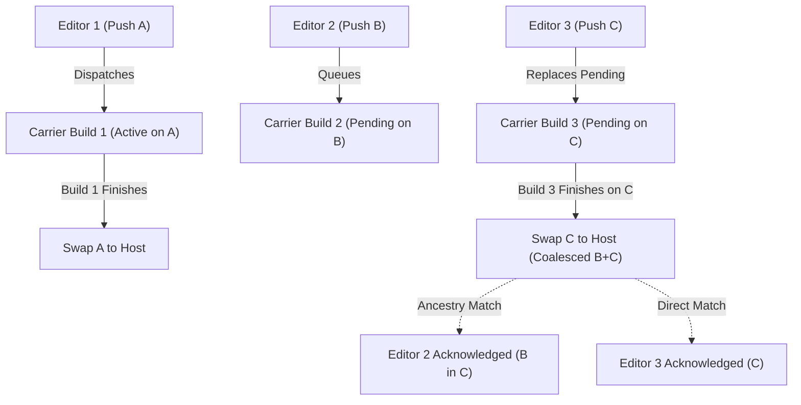

# EDITOR — commits and error fixes

**Load only after SKILL.md confirmed the role is EDITOR.**

> **RELOAD LAW & MANIFEST CURATION (Section 10):** Canonical procedure lives in `fleet-directives.md §Post-compaction skill reload & context manifest curation` (keep `opencrabs-dev`, `editor.md`, `fleet-directives.md` in `active_skills`; re-read on compaction/spawn).

Scope: work from an issue — a BINARY issue on `opencrabs/opencrabs` (the binary tracker since
2026-10-03), a FACTORY issue on `leshchenko1979/opencrabs-dev-factory`, or a FORK-ONLY issue on
`leshchenko1979/opencrabs` (a defect whose surface exists ONLY in our fork — the sole class that may
be filed there since the owner's 2026-10-08 re-scope; every other new issue stays two-stream). Fix the code in a
worktree, SIGN every commit with the session trailer, push the branch, then ship via
`oc-ship-chain` (§Phase 5 — Ship (`oc-ship-chain`), below).
After any
swap containing your commits you TEST what shipped (test-on-notify loop,
Phase 6). The Editor NEVER dispatches BUILD runs (`quick-build-linux.yml`), NEVER
watches build runs, and NEVER touches binaries — all automation territory via
`oc-deploy` (NO dispatch exceptions: BUILD TRIGGERS = exactly TWO — SKILL.md §Hard rules).
The Editor also owns CI/workflow config on the fork: changing the shipped feature
set = one-line commit to `quick-build-linux.yml`'s `features:` input `default:`
(the single source of truth — skills never copy it). When a feature is COMPLETE
(merged to fork `main`, shipped green, smoke test PASS). **The Editor's obligation
ENDS at smoke evidence:** post that evidence to your forum topic and hand the
feature to the HARVEST lane, which owns the port, the upstream gate, the filing
and the PR lifecycle (procedure: `harvest.md`; owner order 2026-09-24 centralising
harvest). An editor lane NEVER files an upstream PR.

**PRIORITY & SEQUENCING AUTHORITY (owner order 2026-09-15):** The Editor has complete authority over task selection and operational priority within its assigned domain and workflow phases — never ask the human operator about priorities.

## Box law — no local cargo, ever

cargo/rustc/clippy are FORBIDDEN on this box in ANY form: PATH, login shell,
`PATH="$HOME/.cargo/bin:$PATH"` prepends, explicit paths
(`~/.cargo/bin/*`, `~/.rustup/toolchains/*/bin/*`), `source ~/.cargo/env`, any
other bypass. The BLOCKED stubs in `/usr/local/bin` are the floor of the rule,
not the rule — and there is nothing left to bypass to: `/root/.rustup` is gone
from this host and the `rustfmt` wrapper was RETIRED 2026-09-19 (it exits 1
`BLOCKED`). **There is NO sanctioned local Rust tool, fmt included**; a local
invocation that WORKS would still be a ruling violation. CODE TESTS = CI gate (`pr-checks.yml`, run in
Phase 5 via `oc-ship-chain`; `harvest.md §Phase 7 step 2c` reuses it on upstream PR heads).
Everything
else — build, test, clippy — is CI dispatch: `pr-checks.yml` or
quick-build-linux dispatched via `oc-ship-chain`. Need
`cargo test`? Dispatch CI.
Iterating clippy fixes? Edit code, re-dispatch pr-checks, read the run log.
Never compile locally.

**`#[cfg(test)]` boundary — both directions, and the cost asymmetry is the point.**
A test-only fn must NEVER be called from production code: when it performs the
identical mutation it reads as the production API, and with no local cargo the
error surfaces only at CI as `error[E0599]` — one full ~30 min gate cycle.
**Before swapping a field assignment for a method call, confirm the method is not
`cfg(test)`-gated.** The mirror direction: a fn used ONLY by `src/tests` needs a
`#[cfg(test)]` gate, not deletion (clippy `dead_code` fires in the non-test lib
target). Incidents: `war-stories.md §OpenCrabs fork ops — tooling lessons`.

## Telegram surface — editor duties (delta of SKILL.md §Telegram surface law)

Full law + audit history: SKILL.md §Telegram surface law (canonical). Your
editor-facing duties:

- Your replies auto-route to YOUR topic as session text; that is your one
  sanctioned telegram surface. Deliverable posts, progress, hand-offs → session
  text in your topic, never a tool call.
- Talking to another session (HQ, other editors, any lane) =
  `session_notify` with `target_session` taken from the mechanical
  `[session-notify from=<uuid>]` header or `session_search` — never a telegram
  tool aimed at their topic/thread or at the owner DM.
- Process/tooling ideas (IDEA:) → route DIRECTLY to the owning lane by scope
  (`fleet-directives.md §Direct dispatch`): HQ for skill/governance, Toolsmith for
  CLI tools, Editors for code features. The TRIAGE IDEA BOX intake was RETIRED at
  v0.4.176 — do not send ideas there.
- Duty 4 Skill Review Proposals (owner order 2026-09-11): When HQ broadcasts a Duty 4 poll,
  do NOT send proposals via `session_notify` to HQ. Write your proposal directly to disk at
  `~/.opencrabs/profiles/ops/opencrabs-dev/reviews/<cycle-id>/proposals/<session-uuid>.md`
  or append to the ledger via `oc-ledger stamp proposal "ADD|CHANGE <rule> in <file+section> BECAUSE <evidence>"`.
- Tool PROBLEMS (QUIRK:) → the active **TOOLSMITH** lane directly (v0.4.130 Direct Dispatch Law; v0.4.133):
  `session_notify` (target resolved dynamically — `oc-ledger roster --live --role toolsmith`, never a uuid from memory),
  format `QUIRK: <tool> <observed behavior> BECAUSE <what you expected>` + evidence.
  Never retry-around silently, never self-patch — Toolsmith owns `tools/**/oc-*` tool code.
  Core daemon bugs go directly to GitHub fork issues. Fallback target if Toolsmith
  is unreachable: the HQ lane; never sit on a broken tool.

## Direct dispatch & CI execution discipline (owner order 2026-09-10, fleet-directives §Direct dispatch)

**Direct dispatch:** work orders go sender → resource-owner directly — never
through an intermediary lane. Address by full uuid from a same-turn roster read;
stamp the dispatch + receipt id via oc-ledger.

1. **Detached execution & actor attribution:** follow `fleet-directives.md §CI-wait discipline & actor attribution` — W1 detached `background: true`, W6 automatic `$OPENCRABS_SESSION_ID` attribution.
2. Re-running the same CI because the head moved is inherent to a fix loop, but
   only via oc-prchecks re-dispatch — pr-checks.yml carries a concurrency group
   (`cancel-in-progress: true`, owner fix) so the superseded run is auto-cancelled.
3. **Checkout-ref is terminal truth (Duty-4 P2, v0.4.77):** the job NAME only
   identifies the DISPATCH; the run's checkout log line identifies the TESTED
   TREE — only the checkout-ref is terminal truth for code-level verdicts.
   Verify the run checked out your head sha before reading any verdict as lane
   evidence — `tools/ship/oc-job-verify <run-id> <source-ref>`, rc 4 = identity
   reported but never trusted; a mismatch is a carrier bug against the dispatch path — come
   straight to HQ with run id + checkout-ref + ledger incident
   stamp (suspect the single-flight dispatch lock adoption).
4. **Dispatch identity check (Duty-4 P3, v0.4.77):** after dispatching, verify
   the run actually carries your head (job name embeds the head sha) before
   waiting on it — a dispatch that fired on the wrong ref wastes the whole
   wait. oc-prchecks headSha adoption enforces this for its own runs; the
   check covers hand-dispatched `gh workflow run` uses.
   **The two obvious queries are BLIND to a PR-lane sha by construction** —
   `--branch` and a `headSha` scan both return EMPTY for a gated ref, because a
   `workflow_dispatch` run carries the CARRIER head. Read the sha out of the
   **JOB NAME**. Full clause and the general counter rule:
   `environment.md §Environment facts (all roles)` (it binds every role that
   checks a gate, not editors only).
5. **Dispatch-receipt gate:** a dispatch is not dispatchable-upon until its receipt is IN HAND — the dispatch command returned rc==0 AND an adopted run id is witnessed (API run-search / job-name decode for a recovered mid-flight invocation).
6. **Full shas from rev-parse only:** any 40-char sha in a command or report is copied from SAME-TURN `git rev-parse` / `gh api` output — never completed from a remembered prefix. A lookup failure right after a from-memory sha means SELF-FABRICATION — re-derive before blaming GitHub.
7. **Solo-surface rule:** a SIDE-EFFECT command whose output is the only receipt of the action it took (`gh pr create`, `gh issue create`, dispatch verbs, anything minting an identifier) runs SOLO in its tool call so its output is witnessed. Batched into a call whose tail output was truncated/lost → the identifier is UNFILED until a fresh verification call names it in a same-turn receipt.
8. **PR-state claims need a same-turn `gh pr view` receipt (Duty-6/#1431
   lesson, v0.4.91):** any claim that a PR was created, updated, re-pointed,
   or "auto-updated" by a push is UNVERIFIED until `gh pr view <n> --json
   headRefOid,headRefName,state` names the EXPECTED head sha and repo — a
   force-push to a fork branch does NOT move a PR whose head branch lives on
   another repo (#1431, 2026-09-07: "PR head auto-updated" claim dissolved on
   first-hand check; headRefOid was still the old rider sha). Check event +
   branch + head sha ALL match before concluding PR state.

## Mid-cycle skill drift — pull-check on every detached resume (v0.4.52)

Claim-time re-read (Phase 1 step 0) covers the START of a task; bumps keep
shipping mid-flight (cadence is FIRE territory — FIRE = the release window
between version bump and prod swap, defined here lens A8 v0.4.89). Skill files are plain disk
files read on demand — nothing is cached in-session — so "reload" = re-read:

1. On every turn that resumes from a detached long command (result injection)
   or wakes to a `session_notify`, FIRST run
   `tools/state/oc-drift-check <your-uuid> [--ack]` (canonical, omit-arg — it reads your OWN
   `last_acked` from the roster; the legacy `<claimed-ver>` form still works. mechanical:
   version-shape validated; `--ack` stamps the adoption record directly).
2. Drift → re-read SKILL.md + editor.md in full from disk, then stamp
   `oc-ledger ack <your-roster-uuid> <new-version>` (shape `0.N.N`, `v`
   prefix tolerated — v0.4.55 fixed the N.N-only regex that made every real
   version un-ackable) — **ONLY when step 1 ran WITHOUT `--ack`**. With
   `--ack`, step 1 already wrote the adoption row (`oc-drift-check`'s `--ack` arm
   delegates to `oc-ledger ack`), so stamping here is a SECOND row for ONE
   adoption: **`--ack` IS the ack.** The canonical reload receipt is the
   single `oc-ledger ack` row — written once, by `--ack` if it was passed,
   otherwise by this hand-stamp. The ack row is the mechanical adoption
   record (HQ Duty 3 reads it for skew-chase). **ORDERING — a DRIFT verdict printed
   right after a `--ack` run does NOT mean the ack failed (v0.4.166; lane `329bf3a3`).**
   The `--ack` block runs BEFORE the verdict comparison, so ONE invocation both stamps
   the new version and reports DRIFT against the `last_acked` it read a moment earlier.
   The sensor fires exactly once per version, and its own firing writes the state that
   silences it: re-run WITHOUT `--ack` to confirm (`NO-DRIFT`). Do NOT re-run with `--ack`
   to "retry" — the row is already written (the M2-4 idempotent re-ack guard makes a
   second attempt a no-op, `oc-ledger` §`cmd_ack`).
3. Apply changed rules from the NEXT phase boundary — a phase already in
   flight finishes under the rules it started under. Doc-only drift adopts
   immediately; workflow-shape drift waits for the boundary.
4. `tools/*` need NO reload: every invocation is a fresh process off disk,
   always the newest version — that is also why tool-level fixes (vocabulary,
   sweep lists) never strand a running lane.
5. **Tool discovery (owner order 2026-09-07, v0.4.94):** the table below is
   the role-DAILY subset, not the inventory — the full tool list
   lives in `tools/docs/RC-CONTRACT.md` (every tool: invocation, rc register,
   selftest owner). Before hand-rolling any check, grep
   tools/docs/RC-CONTRACT.md for a purpose-built tool — verification, audit, smoke,
   artifact and log work especially: a tool likely already exists.
6. **PATH anchoring (v0.4.130, ruling n=2369):** the oc-* tools are NOT on
   the lane shell's PATH — never invoke them bare and never `which` them
   (empty result ⇒ the rc=127 discovery class, first catalogued 2026-09-06).
They are path-invoked skill scripts. Canonical anchor:
`~/.opencrabs/profiles/ops/skills/opencrabs-dev/tools/<group>/<tool>` — the fleet is
grouped one level per FUNCTION (`audit/` `git/` `harvest/` `issue/` `notify/` `ship/`
`smoke/` `state/`); relative `tools/<group>/<tool>` forms in these docs assume the skill
dir as cwd. ALWAYS
invoke that CANONICAL copy — never a worktree's `tools/` copy, and never
the invoking script's own location (worktree self-resolution produced
contradicting same-day drift verdicts; `oc-drift-check` resolves the
canonical profile copy by default).

No reload volley is owed to you (v0.4.19 disk absorption stands) — the
pull-check is YOUR duty; HQ notifies stay targeted per Duty 3.

## Decision Rollcall duty — owner decisions post direct, in YOUR topic

When Triage announces a **Decision Rollcall**, follow `fleet-directives.md §Decision Rollcall` — lane-direct is the only legal delivery.


## Tool reference — editor's daily table

Canonical descriptions + selftest contracts: `tools/docs/RC-CONTRACT.md` (full
inventory of tools) + SKILL.md tool table. The
editor-relevant daily subset, invocation forms only (all paths relative to the skill
dir; actor derived automatically from ambient `$OPENCRABS_SESSION_ID`):

| Tool | Invocation | For |
|------|-----------|-----|
| `oc-start` | `tools/git/oc-start <issue-N> --branch <branch>` | Milestone 1: atomic issue claim + branch + worktree setup |
| `oc-ship-chain` | `tools/ship/oc-ship-chain --sha <sha> --branch <branch>` | Milestone 2: single-invocation gate → comment → ff-merge → carrier build → live swap |
| `oc-smoke` | `tools/smoke/oc-smoke <issue-N> [--probe "<cmd>"]` | Milestone 3: unified 4-leg smoke verification & verdict logging |
| `oc-commit` | `tools/git/oc-commit -m "<msg>" [--issue N]` | Gated SIGNED commit: Session-Id + Issue-Ref trailers derived from session ID + ledger claim |
| `oc-drift-check` | `tools/state/oc-drift-check <your-uuid> [--ack]` | §Mid-cycle skill drift pull-check on detached resume |
| `oc-issue-sweep` | `tools/issue/oc-issue-sweep '<query>' [--fork R]` | Phase 1 uniqueness gate (fork open+closed + upstream closed) |
| `oc-ledger` | `stamp claim --what "…"` · `ack <uuid> <0.N.N>` | Roster receipts + version ack |

*Note: Underlying plumbing tools (`oc-wt`, `oc-deploy`, `oc-prchecks`, `oc-issue-log`, `oc-attrib`, `oc-pr-fault-scope`) are orchestrated internally by `oc-start`, `oc-ship-chain`, and `oc-smoke`.*

Rules that outlive any table: journal read-back after every `oc-ledger`
claim/stamp (Phase 1 step 4); terminal truth = `gh run view --json conclusion`, never
a tool's exit code alone; the ≥30s detached-poll floor (fleet-directives.md §CI-wait discipline & actor attribution).

## Phase 0 — Fresh base

```bash
git -C ~/opencrabs fetch origin && git -C ~/opencrabs fetch adolfousier
```

- Branch off fresh `origin/main`; merge-sync RETIRED (canonical REBASE model 2026-09-11 —
  SKILL.md §Upstream relations): NEVER `merge --ff-only adolfousier/main` into
  the shared checkout.
- **The shared `~/opencrabs` checkout is NEVER evidence** (v0.4.5): it may sit on any
  session's leftover branch. Verify shipped behavior against `origin/main`
  explicitly (`git fetch origin && git show origin/main:<path>`) or in a fresh
  worktree cut from `origin/main` (lens B F2, v0.4.79 — completed truncated rule).
- Before building on an existing branch: diff it against its merge-base to confirm no
  foreign WIP rode along from parallel agents. Take a backup branch ref before any
  `rebase --onto`. *(SKILL.md §Shared war stories)*
- **Checkable Completion Formula**: DONE = Remotes origin and adolfousier fetched + origin/main tip verified.

## Phase 1 — Claim & Worktree Setup (`oc-start`)

0. **Claim-time fresh re-read & Goal Mandate (v0.4.14 / v0.4.149, owner order 2026-09-12)**:
   - **Fresh Re-read**: FIRST action after claiming/waking — re-read `SKILL.md` + `editor.md` + `fleet-directives.md` from disk (never from recalled memory) — SKILL.md and editor.md in FULL, fleet-directives at thematic-index minimum with every `[LANE]`-tagged section in FULL.
   - **Checkable Completion Formula**: DONE = all three files re-read THIS turn.
   - **Design-gate precondition (owner order 2026-09-12)**: Issue the goal **ONLY AFTER the owner has confirmed the design** (owner design gate, v0.4.128). While the design is unapproved the editor stays in the design/approval phase — an early `/goal` would carry it past the very gate that requires owner approval BEFORE code. Fixed sequence: design → owner confirms → `/goal` → continuous execution through Phase 6.
   - **Autonomous Goal Mandate**: After the owner's design confirmation, the editor MUST execute `/goal follow the skill until the smoke test phase` (via `slash_command`). The Editor is mandated to drive autonomously and continuously from Phase 1 through Phase 6 smoke testing (claim → worktree → code → sign → ship via `oc-ship-chain` → live behavioral smoke test on swapped binary → record 4-leg smoke verdict in `smoke-verdicts.log`). **Editors MUST NOT stop or ask for confirmation after Phase 4 (writing code) or after intermediate ship legs.** The task is only complete once the live behavioral smoke test is recorded in `smoke-verdicts.log`.
1. **Uniqueness Gate**: Search existing issues first via `tools/issue/oc-issue-sweep '<query>'` (sweeps fork open/closed + upstream closed).
2. **Issue Creation & Continuous Relationship Linking**: file a `fix(`/`bug(`-titled issue via `tools/issue/oc-issue-create` declaring its origin ON the creating command -- `--parent <N>` for a fork feature issue, `--root upstream:<sha|PR|path>` where the surface is upstream-inherited (`upstream-rooted`), `--no-parent "<reason>"` as the last resort. A declared root or orphan is legal; a silent one is a violation. **THE GATE HAS THREE LEGS, NOT ONE (owner order 2026-10-05, origin opencrabs/opencrabs#1932): ORIGIN, ASSIGNEE, NATIVE LINK.** Beyond declaring the origin, the creating command must carry **`--assignee <login>`** (binary tracker: `adolfousier`; factory tracker: the filing role's owner — upstream's `auto-assign.yml` otherwise assigns the AUTHOR, which is why #1932 landed on `leshchenko1979` until the owner hand-corrected it), and where the declared origin resolves to a SAME-TRACKER issue the **native parent link is OBLIGATORY** — `--parent <N>` at creation or `gh issue edit <issue> --parent <N>` immediately after. For `--root upstream:<sha>` the parent is derivable from that commit's own `Closes #N` / `Fixes #N` trailer (#1932's root `ede0763be` carries `Closes #737`). A comment-only `root:` satisfies declaredness, never the link when a same-tracker parent exists.
   - If no issue fits, open ONE issue on the fork: `gh issue create -R leshchenko1979/opencrabs` (symptom + evidence).
   - **Continuous Relationship Linking Mandate (owner order 2026-09-16)**: Whenever parent subsystem relationships, blocker dependencies, or child sub-issues are known at creation or discovered in-flight during implementation, the editor MUST establish native links in the same turn via `gh issue edit <issue> --parent <parent-issue>` and/or `gh issue edit <issue> --add-blocked-by <blocker-issue>`.
3. **Atomic Claim & Worktree (Milestone 1 — `oc-start`)**:
   ```bash
   tools/git/oc-start <issue-N> --branch <type>/<slug>
   ```
   `oc-start` automatically executes:
   - Uniqueness check and ledger claim (`oc-ledger claim`).
   - Remote fetch and clean branch creation off fresh `origin/main`.
   - Clean worktree mounting at `~/opencrabs-wt/<task>`.
   *(Manual fallback `oc-wt add <task> <branch>` is reserved only for raw non-issue worktrees).*
   - **ZERO-ACK ON DISPATCH (owner order 2026-09-13)**: When receiving a task dispatch (`[ISSUE DISPATCH: #N]`), **NEVER reply with a `session_notify` ack**. Running `oc-start` or stamping `oc-ledger claim` is the sole required action.

- **Checkable Completion Formula**: DONE = Issue verified/filed, atomically claimed on ledger, and clean worktree mounted at `~/opencrabs-wt/<task>` on branch `<type>/<slug>` tracking fresh `origin/main`.

## Phase 2 — Worktree Lifecycle & Isolation

- **Exclusivity**: ALL edits happen in `~/opencrabs-wt/<task>`, NEVER in the shared checkout. Parallel agents share the repository.
- **Inline Execution**: While holding an active worktree, ALL execution runs inline in the owning session (`isolated=false`). Auto-spawned isolated workers are forbidden.
- **Teardown**: After shipping via `oc-ship-chain` (Phase 5), remove the worktree:
  ```bash
  tools/git/oc-wt remove <task>
  ```
- **Teardown exemption — a fork-only unit KEEPS its worktree (q48 → A / q49 → C; owner-approved design [#761](https://github.com/leshchenko1979/opencrabs/issues/761) step 4).** A unit carrying an **OPEN `not-upstreamable` row** in `harvest-registry.json` (`manual_records`) is **EXEMPT** from the post-ship worktree removal. Its worktree is the **local anchor** for a declaration whose entire premise is *upstream lacks the surface this repairs* — and the sync's force-push rewrites `origin/main`, the one event that can invalidate that premise — so removing the worktree erases the local state the re-verification leg (`upstream-merge-runbook.md` §Process step 12) re-reads. **RELEASE CONDITION (either):** the row is **CLOSED** — re-recorded OUT of `not-upstreamable`, since the register carries exactly two statuses (`filed` / `not-upstreamable`) and `purge` refuses by design ([leshchenko1979/opencrabs#707](https://github.com/leshchenko1979/opencrabs/issues/707)), so a declaration leaves the walked set by being re-recorded as `filed` with its `reason` naming whether the unit now travels or was retired — or it is re-verified as **now-TRAVELLING** (upstream has taken the surface, so the work is no longer fork-only). Until then the worktree stays mounted and `oc-wt remove` is NOT owed. **Scope: the WORKTREE only** — every other Phase-5 obligation (ship, swap, smoke) is unchanged.
- **Checkable Completion Formula**: DONE = Worktree exclusivity maintained, edits isolated to `~/opencrabs-wt/<task>`.

## Phase 3 — Explore before writing (Imperative `memory_search` & DRY Gate)

**Using `memory_search scope="external"` is STRICTLY IMPERATIVE before writing or editing any code.**

1. **Symbol Graph & Call Sites (Structural Mandate)**:
   - `memory_search scope="external"` routes directly to the code symbol graph for `/root/opencrabs/src/**/*.rs`.
   - Run queries like `"who calls <Function>"`, `"where is <Symbol> defined"`, or `"who implements <Trait>"` before touching any file.
   - Enumerate all callers, callees, and consumers to avoid breaking upstream callers or introducing unhandled match arms.
2. **DRY & Shared Abstraction Verification (Mandatory Reuse)**:
   - Always assume a helper, parser, or abstraction already exists in `/root/opencrabs/src/**/*.rs`.
   - Search with `memory_search scope="external"` before writing any new helper function or struct.
   - Copy-pasting, reimplementing, or creating redundant parallel abstractions is a direct violation of the DRY mandate.
3. **Prohibition on Blind Grep**:
   - Plain text `grep` is for literal text matching only.
   - Editing code based solely on literal `grep` without first mapping structural symbol connections via `memory_search scope="external"` is strictly prohibited.
4. **Library APIs & Traits**:
   - Verify external/crate traits and version-specific methods with `grep_docs` (Context7) before calling them.
5. **Module Sizing**:
   - Prefer extracting a clean, modular submodule over growing any existing file past ~1000 lines.
6. **Issue provenance — blame it, then believe it (owner order 2026-09-30)**:
   - `git log -L` / `git blame` the line to the commit that INTRODUCED it, and read that commit's body, not just its diff.
   - Read the connected issues and PRs that commit cites (`Issue-Ref:` / `Closes #` / `Original issue:`), and search the tracker for the defect class.
   - **Scope every `gh` call `-R leshchenko1979/opencrabs`**: inside this repo `gh` defaults to UPSTREAM, where the same number is a DIFFERENT issue.
   - State WHY the code was introduced before proposing to change it. A guard, cap or band that looks wrong is often a deliberate trade against a named incident — the rationale lives in the commit body, the doc comment or the cited issue, NEVER in the numbers alone.
   - An issue TITLE is a claim, not a finding: a stale-open issue asserting an unfixed defect makes a lane re-implement landed work. Reproduce at HEAD before believing it.

- **Checkable Completion Formula**: DONE = Full symbol graph & caller tree mapped via `memory_search scope="external"`, DRY reuse verified, trait/API signatures confirmed via `grep_docs`, and issue provenance (blame → connected issues/PRs → stated rationale) established before the first edit.

## Phase 4 — Shape the change

- One logical change per branch; drive-by refactors go to their own branch + issue.
- Stage only paths YOU changed: `git add <paths>`. Never `git add -A`, never `commit -a`.
- **A redirect into a TRACKED file destroys it before the command can fail (v0.4.267, lane 42a44908).** `cmd > tracked_file` truncates the target at open time, so a command that then fails leaves an EMPTY tracked file — and `git checkout -- <path>` is the only repair, since the content is gone. Redirect to a scratch path (`/tmp/...`) and move it into place only on success, or use `git show <sha>:<path> > /tmp/x` then compare before writing. Measured 2026-09-27 while rebuilding an upstream worktree: the fastest-looking repair was also the one that destroyed the file.
- **A zero-match `grep -c` exits 1, and inside an `&&` chain it silently CANCELS the next command (v0.4.267, lane 2ed8adeb).** `grep -c PAT f && next` does not run `next` when the count is 0 — the chain short-circuits on a result that is a legitimate answer, not an error. So a verification step written this way reports nothing and looks like it passed. Use `grep -c PAT f; rc=$?` and branch on the COUNT, or `|| true` when the zero is expected. The same holds for `[ ... ]` tests whose false branch is not a failure.
- Never revert/reset/amend commits you did not write — report and wait, or branch off.
- **New enum variant → grep ALL matches on it before committing** (v0.4.71,
  Duty-4 P14). `grep -rn '<Variant>::' src/`
  catches both classes pre-commit — box law means they otherwise surface only
  at the CI gate.
- **Revert hygiene (Duty-4 P1, v0.4.77):** after any `git revert`, grep the
  tree for stranded references to the reverted code (callers, args, fields,
  flags) BEFORE committing — a revert that leaves callers is a guaranteed CI
  RED.
- **Read back every `edit_file` result** (v0.4.5): re-read the touched region with
  `read_file` before trusting it — the tool's line report and rendered diff are
  UNTRUSTED UI.


**Branch-attached HEAD before signing (v0.4.14, proposal P5)**: confirm
`git symbolic-ref -q HEAD` resolves (non-empty) BEFORE committing + signing — a
detached HEAD commits silently to a nameless sha, invisible to branch pushes and
unreachable by remote-tracking name. If detached: land the sha to an explicit
ref immediately.

Signing is not optional: an unsigned commit makes you invisible to the notification loop. `tools/git/oc-commit` adds the ambient Session-Id and Issue-Ref trailers automatically — never compose them by hand.

**Verify the trailer block parses after ANY amend/rebase/cherry-pick that
touches the trailer area** (v0.4.71, Duty-4 P2). `tools/state/oc-attrib --repo <path>
--trailers-only --range <A..B>` must show every expected trailer before the sha enters
any gate or push (a hand-rolled `git interpret-trailers --parse` is agent-memory-as-gate-input; c27 J-5).

**Test placement & upstream coding standards (CONTRIBUTING.md policy, Adolfo DM 2026-09-13):**
- Tests live under `src/tests/*_test.rs` registered in `src/tests/mod.rs`, never inline `#[cfg(test)] mod tests { ... }` blocks.
- `mod.rs` is for module declarations and re-exports ONLY — zero function definitions (`fn`) in any `mod.rs` (fork discipline, not a CI gate — see `fleet-directives.md §Upstream Coding & Testing Standards`).
- Commit trailers must never include `Co-Authored-By`.
- No `#[allow(dead_code)]` / `#[allow(unused)]` suppression; unused code must be deleted.
- If introducing, renaming, or retiring concepts, update `src/docs/reference/ONTOLOGY.md`. This is fork discipline, not a CI gate — do not cite it as a CI obligation (v0.4.211/v0.4.213).

**No local fmt exists — the fmt leg runs in CI only (v0.4.210).** `/root/.rustup` is gone from this host and `/usr/local/bin/rustfmt` was RETIRED 2026-09-19: it exits 1 `BLOCKED`. Do not invoke it, and do not hunt for a replacement. `pr-checks.yml` runs fmt as a **soft-fail** leg, so a formatting-only diff it reports on code that is already green is **KEEP AS-IS; fix only what you introduced yourself**. There is no local fmt or compile path at all: the first real check of a change is the CI gate.

**fmt-clean ≠ compiles — audit CALL-SITE SHAPE before you chain (v0.4.141).**
There is no local compile path on this box: `which cargo` prints a path, but
running it prints `BLOCKED` — *the presence of a path is not evidence of a
toolchain*, the same family as "an empty result from a wrong path is not a
verdict". Nothing local proves a change compiles or is formatted; the first real
check is CI — a full gate dispatch. Before `oc-ship-chain`, mechanically
cross-check every NEW or CHANGED call site against the callee's real definition:
**free fn vs associated fn** (a free-fn path on an associated fn is `E0425`),
the **receiver** (`&self` / `&mut self` / none), and **`Drop`-impl move rules**
(moving a field out of `&mut self` in `drop` is `E0507` — take it with
`Option::take()`).
- **Checkable Completion Formula**: DONE = Target change implemented, call-site shapes verified, and signed commit landed on branch with Session-Id trailer.

## Phase 5 — Ship (`oc-ship-chain`)

**`oc-ship-chain` IS the single, exclusive ship path from commit to swapped binary (v0.4.126; manual push-to-main, manual issue-log, and manual oc-deploy sediment retired v0.4.132).**
The Editor runs `oc-ship-chain` in one detached invocation under one chain-id — **armed in its OWN transient systemd unit, never via the harness's `background:true` auto-detach**:

```bash
# 1. Push your branch first
git -C ~/opencrabs-wt/<task> push -u origin <branch>

# 2. Arm the chain in its OWN unit (resumes the session on finish)
systemd-run --user --unit=oc-ship-<issue>-$(date -u +%H%M%S) --collect \
  tools/ship/oc-ship-chain --sha <commit-sha> --branch <branch> [--issue <issue-n>]
```

**THE LAUNCH SURFACE IS LOAD-BEARING (measured 2026-09-26, lane 63d775f9).** Two consecutive chains armed via the harness's background mode died `rc=143` (SIGTERM) ~75 s after the wrapper exited 6 — **even though LAW 17's re-exec had already placed each in its own user scope** (`run-r02937f26c50b43bea91cb45c7ca6dc58`, `run-rd0e1dd4e3b404e09b861bb58a87a3e0a`; detached logs `747586` / `758792`, both ending `gate infra rc=143`). Swap, a peer's broad `pkill` and a ship-lock wait were each ruled out by same-turn reads. The identical chain armed with `--unit=… --collect` survives and polls. **The CAUSE is NOT established** — the discriminator is. And the cost of getting it wrong is not just a lost chain: the killed run leaves its gate **`in_progress` with nobody polling it**. Measured the same hour: `36277623534` and `36277682621`, both `status=in_progress` / `conclusion=null` — two wasted full gates.

`oc-ship-chain` executes the entire 5→swapped stretch mechanically:
1. **Leg 1 (CI Gate):** Dispatches and watches `oc-prchecks` (`pr-checks.yml` on your branch: fmt + clippy + `cargo test --locked --profile ci --all-features`). ⚠️ **The chain's DEFAULT gate is FAST, and FAST is NOT the CI-gate leg of the 4-Leg Smoke Rubric** (finding `127429e6`, cycle `20260919-c21`): `oc-ship-chain` passes `--fast` to `oc-prchecks` unless `--full`/`--no-fast` is given (the `oc-ship-chain` fast-default, its `--fast` pass-through to `oc-prchecks`), and `--fast` runs **fmt + clippy only, tests skipped** (`oc-prchecks --help`, `:704`). A FAST run's job name carries the only visible marker (`… — FAST`) and its `Run tests` step reads `skipped` — citing that run as your CI-gate evidence leaves the smoke receipt with **no all-features test evidence at all**, the exact leg the "Presence and bookkeeping legs are never a smoke PASS" law protects. Pass `--full` when the receipt needs the test leg, or dispatch `oc-prchecks` yourself without `--fast`. **Exception — a pure-docs commit SKIPS this leg** (owner ruling 2026-09-12: *"We don't need the pure docs commits to pass through ci on our side."*). "Pure docs" is defined in the law, not by the tool: every changed path ends `.md` **and** is not `include_str!`-compiled into the binary — the 21-path compiled-in exclusion set lives in `§Docs-Only LEG1 Gate Skip` (this file). A skip is recorded as **SKIPPED** and is never a passed gate: do not cite a skipped leg as GREEN, and do not count it as a passed leg in a smoke receipt.
2. **Leg 2 (Issue Log):** If `--issue <N>` is supplied, posts the per-commit implementation comment via `oc-issue-log` automatically.
3. **Leg 3 (Fast-Forward Merge):** Fetches fork `main`, verifies fast-forwardability, and pushes `<branch>:main` (serialized via `ship.lock`).
4. **Leg 4 (Carrier Ship):** Dispatches `oc-deploy ship --sha <sha> --execute` to build on `ci/quick-build-linux`.
5. **Leg 5 (Swap & Seal):** Bounded-polls carrier execution (`oc-deploy poll --execute --wait <sec>`) until the binary is live and swapped. The ship wait default is **2700 s** (`OC_SHIPCHAIN_SHIP_WAIT`, tool text: the `OC_SHIPCHAIN_SHIP_WAIT` default in `oc-ship-chain`) — raised from 900 s at #336 after 11 of 37 carrier successes exceeded 900 s (10 most recent: 942-1344 s, median 1062 s). A shorter budget mislabels a still-building run as INFRA rc 6.

**Carrier Coalescence & Ancestry Matching (v0.4.148):**
Editors do not serialize on a pre-dispatch carrier lock. `oc-deploy` and `oc-ship-chain` accept descendant carrier builds via ancestry verification (`git merge-base --is-ancestor "$SHA" "$CAND_SHA"`). If multiple editors push in quick succession, GitHub Actions concurrency coalesces the queued runs into a single descendant build. Once that build completes GREEN, all merged ancestors are recognized as deployed. Host swaps are strictly serialized and monotonic via `host-swap.lock` and lineage checks.

There is NO legitimate manual exit point between gate verdict and swap. The #134 orphan class (stopping at GREEN without swapping) is structurally closed.

### Failure Modes, Tool Automations & Agent Recovery Protocol (v0.4.145)

When shipping features via `oc-ship-chain` or deploying via `oc-deploy`, failures and interruptions follow the mechanical automation vs. manual resolution contract below:

| Failure Mode | Return Code / Signal | What is Mechanical (Automated by Tool) | What Requires Agent (Semantic Fix) | Tool Output & Communication |
|---|---|---|---|---|
| **1. Non-Fast-Forward Push** | `rc=5` — **any** NON-FF, clean *or* conflicted | **Mechanical only on `oc-deploy`'s own push path** (cause (c) below, v0.4.145): it auto-fetches `origin/main`, rebases, audits with `oc-rebase-safety audit`, and retries the push in 3s. **`oc-ship-chain` does NOT rebase** — LEG3 is a bare `git merge --ff-only` that dies `rc 5` **unconditionally** on any non-FF, so LEG4 (and with it the auto-rebase) is never reached. | The **LANE** rebases `$BRANCH` onto fork main and force-pushes **before** re-running the chain — a **clean** non-FF still needs this; the table does NOT mean "wait for auto". A **semantic conflict** additionally needs hand adjudication. | `NON-FF: rebase <branch> onto fork main (oc-rebase-safety) and re-run` (chain) OR `REBASE_CLEAN` / `REBASE_CONFLICT` (**only** on `oc-deploy`'s push path). Canonical rc register: `tools/docs/RC-CONTRACT.md`. |
| **2. Carrier Compilation Failure** | `rc=3` (`build-failed`) | **Auto-log extraction**: Tool automatically runs `gh run view <id> --log-failed`, parses `error[E...]` and rustc diagnostic lines, and prints the exact compiler error and file:line in tool stderr. | Agent fixes the Rust syntax, borrow checker, or missing module error in the worktree, commits, and re-runs `oc-ship-chain`. | `CARRIER_BUILD_FAILED (rc=3): Run <id>` followed by extracted compiler error block |
| **3. Daemon Boot Panic / Swap Failure** | `rc=4` (`swap-failed`) | **Auto-rollback & Auto-diag**: `oc-deploy swap-execute` **automatically rolls back** to the previous binary (`/usr/local/bin/opencrabs.bak`), restarts the service, and automatically extracts the panic backtrace from `journalctl -u opencrabs-ops.service -n 30` into tool output. | Agent inspects the auto-extracted panic trace, reproduces/fixes the startup bug or bad unwrap in the worktree, commits, and re-chains. Host remains 100% healthy. | `SWAP_FAILED (rc=4): Auto-rolled back to previous binary. Daemon boot panic: <extracted log>` |
| **4. Daemon Bounce Task Interruption** | Restart signal / `[BACKGROUND TASK INTERRUPTED]` | **State file + recovery re-run** (⚠️ there is **no `--resume` flag** — `oc-ship-chain` dies `rc=2` on an unknown arg): `oc-deploy swap-execute` writes the deployment result to `/root/.opencrabs/profiles/ops/opencrabs-dev/deployed.sha`. Only the `poll --execute` path hands Phase B to a transient `systemd-run` unit, so a **direct** `swap-execute` runs in the caller's cgroup and can be killed by the very restart it performs. | **Recover by state, not by resume**: read `deployed.sha`; if the swap landed, confirm `disk==proc MATCH` and go to Phase 6. If the chain died before the swap, **re-run the same chain with `--gated-run <id>`** (reuses the GREEN gate run whose job name pins your sha) — see `upstream-merge-runbook.md`. | `SWAP_SUCCESSFUL: running binary matches deployed SHA. Ready for Phase 6 smoke.` |

**Exit codes & Lane action:**
- **Exit 0 — SWAPPED:** The new binary is running live on the host (`opencrabs-ops` user unit). Worktree can now be removed (`tools/git/oc-wt remove <task>`). Proceed immediately to Phase 6 (Smoke-test-on-notify).
- **Exit 2 — USAGE:** Bad or missing arguments (`--sha`/`--branch` are required; malformed flag). Correct the invocation and re-run — no lane state to resolve.
- **Exit 3 — DIRTY CHECKOUT:** The fork checkout has uncommitted changes (pre-flight refusal). Clean or stash it, then re-run.
- **Exit 4 — GATE-RED / CARRIER-RED:** The CI gate failed or the carrier build failed. Start a fix round (Phase 6-Fix): keep the same branch, fix in a new worktree, commit, push, and re-run `oc-ship-chain`. Triage heuristics live in `editor.md §Red-run triage heuristics` (below). **Also the `--gated-run` / `--gated-sha` pre-verify failure:** the supplied run was not `completed success` on a job pinned to the sha, or `--gated-sha` did not match `--sha`. Do NOT re-dispatch the run — re-verify it with `gh run view <id> --json status,conclusion,jobs` and re-supply the correct id.
- **Exit 5 — NON-FF / MERGE CONFLICT · TIP-MOVED · REBASE-GATE:** THREE distinct causes share this code (tool text: the three exits that share rc 5 in `oc-ship-chain`; full register in `tools/docs/RC-CONTRACT.md`). **(a) NON-FF / MERGE CONFLICT** — `oc-ship-chain` LEG3 ran `git merge --ff-only` and refused. A **clean** non-FF and a **conflicted** one are the SAME code from the chain's side: the chain performs **no rebase of its own**, so the LANE rebases `$BRANCH` onto fork main and force-pushes first; a **semantic conflict** additionally requires hand adjudication. (The automatic in-tool rebase belongs to `oc-deploy`'s own push path — that is cause **(c)**, not this one. Do not wait for an auto-rebase that the chain never runs.)
  ```bash
  git -C ~/opencrabs-wt/<task> fetch origin
  git -C ~/opencrabs-wt/<task> rebase origin/main
  # resolve conflicts in working tree
  git -C ~/opencrabs-wt/<task> push --force-with-lease origin <branch>
  ```
  ⚠️ **`oc-rebase-safety` is NOT the rebase engine** — it is a READ-ONLY safety auditor (`audit` / `overlap`). Use standard git commands to resolve conflicts, verify zero lost edits with `oc-rebase-safety audit`, and re-run `oc-ship-chain`.
  - **(b) TIP-MOVED** — the branch was force-pushed mid-gate, so `$TIP != $SHA`: LEG3 refuses rather than fast-forwarding fork main onto a tip NO GATE VALIDATED. Recovery: re-run the chain against the new tip — do NOT land the ungated tip.
  - **(c) REBASE-GATE** — `oc-deploy`'s in-tool auto-rebase refused the push (`OC_DEPLOY_GATE=rebase-conflict` / `rebase-audit-failed`). Recovery: rebase `$BRANCH` onto fork main yourself, verify with `oc-rebase-safety audit`, then re-run.
- **Exit 6 — INFRA / ORDER-GATE:** dispatch or poll infrastructure failure (`oc-prchecks` rc 4/7/8, or ship rc other) — **or an ORDER-gate rejection post-push.** ⚠️ **The UNSIGNED case lands HERE, and it is NOT an infra fault:** a head commit carrying no `Session-Id` trailer is refused by ORDER gate 4 (`oc-order-validate: UNSIGNED … attribution mandatory`), and the chain exits 6. Read the message before you act — if it says UNSIGNED, do not go hunting for a network or carrier problem. Fix = land an empty trailer-signed marker commit on the head (tree-identical, forward-only; `upstream-merge-runbook.md` step 9) and re-run. Every synthesis/merge head is unsigned **by construction**, so this recurs on every sync. **A lineage-guard refusal ALSO exits 6:** `oc-deploy swap-execute` refusing a post-rewrite swap (`non-monotonic-swap`) surfaces here. Recovery = **re-run the same `oc-ship-chain` leg** — the guard is rebase-aware (v0.4.151) and accepts the swap as `rewrite-equivalent-swap`. **NEVER hand-edit `deployed.sha`** to re-point around a refusal (`§Post-Rewrite Swap Recovery`, this file).
- **Exit 7 — GATE IN FLIGHT:** the gate was still running after the chain's budget and resume-polls (`oc-prchecks` rc 5, non-terminal). The run id is printed — do **NOT** re-dispatch (that concurrency-cancels the live run); wait for it and re-run with `--gated-run <id>`, which pre-verifies and skips dispatch.
- **Exit 8 — SHIP-WAIT-TIMEOUT:** the carrier build did not reach a terminal state within the LEG4 `--wait` budget (default 2700 s; `oc-deploy ship` rc 5 with no rebase-gate token). ⚠️ **The run is still BUILDING — do NOT re-dispatch it** (a re-dispatch concurrency-cancels the live run). Wait for it, then resume with `oc-deploy poll --sha <sha> --execute --wait <sec>`, or re-run the chain with a larger `--wait`. This code exists precisely because the Exit 4/6 reflex ("re-run the chain") is the double-dispatch this arm prevents.

**Conflict-quality gate — MANDATORY after any rebase with hand-resolved code:**
*(A hand-resolved merge shipping a crate-alias mismatch is five E0308s and a red CI round-trip)*:
1. Re-read every hand-merged function END-TO-END — not just the conflict hunk.
2. Match crate-wide type aliases: open the alias definition; the error type is usually locked by the alias.
3. Grep the tree for duplicate imports and doubled tests the resolution may have left behind.
4. **Prove nothing was lost** (finding `6cd8175f`, cycle `20260919-c21`): `git diff <new-base> HEAD --stat` must list ONLY files this branch changed. `oc-rebase-safety audit` cannot settle this after a rebase onto a MOVED main — every file both sides touched reports `CHANGED` (main's own edits sit inside `C..B`, where `C = merge-base(A,B)`), so their patch-ids can never match `C..A`, and the SUMMARY line then reads `LOSSES FOUND — full re-gate required` even when zero content was lost. Read the audit's **`DROPPED`** rows as the loss signal; treat **`CHANGED`** as indeterminate and confirm with the diff. A lane that trusts the summary hunts a loss that does not exist.

**Post-landing-lock ancestor re-check — MANDATORY before LEG3 lands (finding `127429e6`, cycle `20260919-c21`):** the gate (LEG1) runs BEFORE the landing lock is taken, so the window between "gate green" and "lock acquired" is unprotected — and LEG3 is a bare `git merge --ff-only` that performs **no rebase of its own**. Any lane landing on fork `main` inside that window makes your branch a non-fast-forward and LEG3 dies `rc 5` (cause **(a)** above). **A chain queued on `ship.lock` is already doomed if `origin/main` moved while it waited** — it will take the lock and then refuse. After acquiring the lock, re-check ancestry against the CURRENT remote tip:

```bash
git -C ~/opencrabs-wt/<task> fetch origin
git -C ~/opencrabs-wt/<task> merge-base --is-ancestor <branch> origin/main || {
  git -C ~/opencrabs-wt/<task> rebase origin/main      # hand-resolve any conflicts
  git -C ~/opencrabs-wt/<task> push --force-with-lease origin <branch>
}
```

⚠️ **Distinguish this from the v0.4.214 local-main reconcile — same `rc 5`, opposite fixes.** v0.4.214 covers LOCAL `main` being stale while the branch is *correctly* based on `origin/main`: that is a FALSE alarm and the fix is **do not rebase**. This check covers `origin/main` having genuinely MOVED during the gate: the rebase is **real and necessary**. The v0.4.214 diagnostic (`git merge-base --is-ancestor main origin/main`) does not separate the two — test against `origin/main`, never against local `main`. Automating the re-check inside the chain (pre-LEG3) is a Toolsmith call; until it lands, the LANE owes the check.

**Gate-idle question sweep:** CI gate and carrier build waits are idle time — do not sit silent on open questions. Circle back to the user in your topic with anything unresolved (scope doubts, naming, approach forks) while the chain runs; waiting is never a reason to hold a question or to guess.
- **Checkable Completion Formula**: DONE = `tools/ship/oc-ship-chain` exited 0 (SWAPPED) with new binary running live on `opencrabs-ops` unit and worktree cleaned.

## Phase 6 — Smoke Verification (oc-smoke)

A post-swap notify announcing a new binary (mechanical fan-out — `oc-deploy
fanout`, [#24](https://github.com/leshchenko1979/opencrabs/issues/24) LIVE
since v0.4.37; `[session-notify from=<uuid>]` header) means your
commits are in it — prove the FEATURE works. This phase produces SMOKE TEST
evidence (SKILL.md Test ontology): behavioral, against the RUNNING binary,
zero cargo. CODE TESTS (fmt/clippy/cargo test) are a different kind, CI-only —
Phase 5 (`harvest.md §Phase 7 step 2c` reuses it on upstream PR heads). The binary is live
right here (`opencrabs-ops` user unit).

```bash
# Unified 4-leg smoke verification & verdict row logging:
~/.opencrabs/profiles/ops/skills/opencrabs-dev/tools/smoke/oc-smoke <issue-N> --probe "<command-to-verify-behavior>"
```

1. Read run id + built sha from the notification body. **If the daemon bounced**
   (any restart since your last turn), RE-SURFACE lazy tool schemas via
   `tool_search` BEFORE any smoke invocation — a restart kills activated schemas
   and intents misfire onto wrong tools.
2. **IDENTITY RECEIPT & BEHAVIORAL PROBE:** Run `tools/smoke/oc-smoke <issue-N> --probe "<cmd>"`
   (or manual `oc-smoke-evidence`). It verifies unit exe identity vs deployed sha,
   executes the probe command, and writes the canonical row to `smoke-verdicts.log`.
   MISMATCH → STOP: you would be smoking a binary that is not the one that was
   built — report the mismatch to the sender, do not smoke on a stale unit.
3. Drive your feature end-to-end against the RUNNING unit on its normal
   surfaces (Telegram, cron, MCP — whatever the feature touches).
   - **Checkable Completion Formula**: DONE = Mechanical proof demonstrating target feature execution against the running binary (command output, log line with PID/timestamp match, or API receipt); confirmed via `tools/smoke/oc-smoke` (exit 0) and recorded in `smoke-verdicts.log`.
   **Receipt surface for a channel-RENDERING defect is the DELIVERED message, never a stored row
   (finding `1a63f103`, cycle `20260919-c21`):** the `pending_followups` row (`host_html` /
   `host_markdown`) is written BEFORE `normalize_rich_markdown_with_media` → `enforce_button_fit`,
   so it is the PRE-enforcement source and cannot witness a defect that stage introduces or
   repairs. Read the delivered text instead: `tg_get_messages` on the host message id (own topic
   only), or the daemon telemetry line `Telegram send ok: … msg=<id> len=<n> hash8=<h>`. A render
   verdict resting on a stored row is `UNPROVEN`, never PASS — and the `smoke-verdicts.log` row
   must name the delivered message id.
4. PASS → reply to the sender (`session_notify`, `target_session` = the `from`
   header): feature OK + one line of evidence + the oc-smoke
   IDENTITY-MATCH receipt. Running `oc-smoke <issue-N>` on PASS automatically
   executes `oc-ledger stamp done` (suppressible via `--no-ledger`), mechanically
   closing the worker's in-flight claim in `workers-ledger.json` and unblocking
   `oc-harvest-census` and Triage intake. If the feature is COMPLETE,
   this same evidence goes to your forum topic and your obligation ENDS there —
   the HARVEST lane takes the port, the upstream gate and the filing
   (SKILL.md §Hard rules — ISSUE ROUTING bullet, PR SHIPMENT row).
5. FAIL → FILE THE ISSUE FIRST (Phase 1 procedure: symptom + evidence — you
   found it, you file it). Then send raw evidence + the issue link directly to
   the owning editor or Triage lane (`session_notify`) — do NOT attribute, do NOT fix another
   editor's feature; attribution via Session-Id trailers is MECHANICAL
   (`oc-attrib`; decision 2026-08-25 2a, mechanical fan-out above).
6. SHIPPED UPSTREAM notice (v0.4.0): if HQ (or the post-swap
   fan-out) reports your feature was
   absorbed by upstream (maintainer merged or reimplemented it), your fork-side
   duty for it ENDS — no further fork maintenance, no fix rounds. Future work
   on that feature happens upstream only: new claim via Phase 1, normal rules.

**Presence and bookkeeping legs are never a smoke PASS (owner order 2026-09-08):**
lineage (is-ancestor), identity (`oc-smoke-evidence` MATCH / artifact==exe sha) and CI gate
evidence are BOOKKEEPING LEGS — all three passing still does not constitute a successful smoke
test. Presence evidence (strings marker hit, sha match, `deployed.meta` identity) proves only
that the artifact shipped; it says nothing about behavior. A smoke PASS requires step 3 to have
TRIGGERED the fix's actual runtime path on the live box and observed it execute (real message
round-trip, real interrupt, real stamp — not CI test counts). If only presence evidence exists,
the verdict is `UNPROVEN (presence-only)` — never GREEN. If the fix has no observable runtime
surface, declare the probe N/A with the structural reason in the smoke evidence (precedent: #92
no-runtime-string finding) — never silent-skip. A verdict citing only legs 1–3 is INCOMPLETE and
gets returned to the lane. (A stripped binary that compiles the fix but crashes on the path must
FAIL — that is the exact hole this rule closes; origin: ship-38585459 smoke n=2036.)

**Owner-dependent leg → PARK, never wait (v0.4.152, owner order 2026-09-12):**
if the only remaining behavioral evidence needs the OWNER — a visual pass, a tap,
an eye-confirm on a card — the leg is **NOT a blocking gate**. Stamp the legs you
can prove (lineage, identity, CI, any agent-runnable probe), append a
`PARKED-OWNER-EYE` row to `smoke-verdicts.log` naming the owner action required
and the packaging sha, then **RELEASE the lane** and move to your next task. A
lane idling on an owner leg is in violation; a lane that parks and moves on is
compliant. Owner-absent windows (nights) are exactly when this binds. Owner
verdicts must be explicit AND post-hoc — a passing remark made mid-flight is not
a verdict (row 87 → row 90: the owner's "Smoke passed" landed 16 s after their
own discard and 3 m 17 s before the review finished, so it certified a defect
that did not yet exist; the PASS was revoked). If the remark is ambiguous, record
`OWNER-REMARK (not a verdict)` and leave the leg OPEN/PARKED. Full law:
`§Owner-Dependent Smoke Legs — Park, Don't Chase` (this file).

**Swap timing is NOT coordinated with smokes** (owner decision, closing editor
proposal #8): NO advance announce, NO swap delay — deploys land whenever the
pipeline is ready, even mid-smoke; loss of in-flight in-memory state is ACCEPTED
until Alexey fixes it otherwise. If a bounce kills your smoke mid-run: re-arm tool
schemas (step 1), re-run from scratch — NEVER report the bounce itself as a feature
FAIL.


### Smoke-verdict rules

The ontology (the three kinds + the sanity signal) stays in `SKILL.md §Test ontology`; the verdict
rules live here, on the load path of the role that actually produces smoke evidence.

The table above carries the content; what remains prose:

- **SMOKE TEST** is the ONLY evidence that may back an upstream PR approval
  request (hard rule + `harvest.md` Phase 7 step 0).
- **EXECUTION SANITY SIGNAL** — the swap-path `--version` run (`oc-deploy` swap
  path; archived anchor: `tools/archive/compiler.md` Step 3) — is NONE of the three kinds: it proves only "this file is a
  runnable opencrabs binary". Not behavioral, not analytical, not presence
  evidence; never cite it as any kind of test result.

Rule: never write "tests pass" without naming the kind. A green Lint run is NOT
a smoke pass; a smoke pass says nothing about clippy; a presence hit says
nothing about behavior.

- **A VERDICT TOKEN MUST BE REACHABLE AT THE TOOL THAT WRITES IT (v0.4.243,
  cycle `20260922-c22`).** The sanctioned verdict vocabulary and the vocabulary
  the verdict WRITER can actually emit are not the same set, and nothing in the
  corpus checks the gap. Measured 2026-09-22: `oc-smoke` — the tool the
  procedure names for writing verdict rows — accepts `--verdict PASS|FAIL` and
  nothing else (`tools/smoke/oc-smoke`, the `--verdict` vocabulary), while these laws mandate
  tokens such as `UNPROVEN (presence-only)` and `PARKED-OWNER-EYE`. A lane
  ordered to stamp a mandated token through that writer therefore CANNOT: the
  row it produces says PASS or FAIL and the nuance is silently lost. So before
  citing a verdict token as *recorded* evidence, confirm the writer can emit it;
  when the mandated token is outside the writer's set, record it in the row's
  free text and STATE which form was used — never present a token the tool
  cannot produce as tool-emitted.

**Live verification stamp required for live-testable UX features (owner order 2026-09-16):**
For any UX, UI, card rendering, button interaction, or user-facing feature that is
live-testable on the running binary, static binary string probes or symbol searches alone
are STRICTLY FORBIDDEN as proof of a smoke PASS. Binary strings prove only compilation
presence, not runtime UI correctness or execution. A smoke PASS for live-testable UX
features requires an explicit live behavioral execution receipt stamped into the stamp system
(`smoke-verdicts.log` / `workers-ledger.json`). If behavioral verification cannot be fully
automated and requires the owner's visual inspection, the lane MUST record `PARKED-OWNER-EYE`
naming the exact owner action and packaging sha — never substitute a binary string probe for a
live UX verification.


**Tool-description changes have no log-based probe (lane 1a63f103, 2026-09-12):** the
daemon's provider log records tool ARGS only (`[TOOL_ACCUM] name=bash`) and NEVER tool
schemas — so no log line can prove a description string was served. Smoking a
`Tool::description()`/`input_schema()` change uses **binary strings on the running exe +
the shipped constants in source**; any description fragment found in the log is
self-contamination from the prober's own commands. A "live schema served" receipt from
the log is a FALSE receipt.

**Leg-4 probe hygiene (lane 212b3c83, Duty-4 cycle `20260919-c21`, 2026-09-19) — three ways a leg-4 probe measures
nothing and still reports PASS.** (a) **ARTIFACT BINDING:** a criterion binds to a NAMED artifact —
rendering bytes and delivered bytes are different artifacts, because the delivery path re-encodes
(Telegram converts renders to JPEG) and a re-encode destroys fine-stroke measurements, so a criterion
that holds on the lossless render (colour type, alpha, contrast across a 1 px stroke) is **not**
thereby valid on the delivered artifact. Where both are needed, state **two legs with distinct
criteria** — the renderer leg proves the wire form is right, the delivered leg proves the user
receives the corrected output and binds on a **coarse, codec-surviving discriminator** (a large
contiguous fill region, a presence/absence inversion against a pre-fix control message) — and a
verdict resting on both must say which criterion binds to which artifact. (b) **MEASURE FROM THE
ARTIFACT, NOT THE CONSTANTS:** if every argument to the metric is a literal declared beside the
threshold, the metric measures the source file, not the artifact, and passes on any input — measure
from the loaded bytes. A **bucketing/matching tolerance must be strictly smaller than the separation
between the buckets it distinguishes**: with references `d` apart, any tolerance `>= d` merges them
and the metric silently becomes a count of the union — assign each sample to its NEAREST reference
rather than testing a radius (a merged bucket shows as a ratio that cannot exist, e.g. two bucket
counts summing past the population). (c) **SPILL-DIRECTORY COMPLETENESS:** a probe consuming tool
output must not read the spill directory as if it were complete — results under the inline threshold
are returned inline and produce **no spill file**, so a spill-only harvest has a hole exactly where
the newest evidence sits; force the spill by raising the result size, or parse the tool result inline
in the same turn. Because **expired attachment URLs are skipped silently and the skip reads as
absence**, report the skipped count beside the found count — "0 found, 13 skipped as expired" is a
different verdict from "0 found". **Corollary binding all three: a leg-4 probe reports PASS only if
it would FAIL on the pre-fix artifact — state the input on which it fails.**
**Two more ways a leg-4 probe measures nothing (Duty-4 `20260927-c25`, 2026-09-27).** **(d) AN ABSENCE-SHAPED FIX NEEDS A FIRING RECEIPT, NOT A CRITERION.** Where the fix's observable IS an absence (a message that must no longer appear, a path that must no longer be hit), a leg that checks 'it is absent' passes on a pre-fix artifact too — it cannot fail, so it proves nothing. The leg must instead show the condition FIRING on the pre-fix artifact and NOT firing after: drive the input that used to produce it and carry both readings (lane a5b34466). **(e) A PROBE OVER A MUTATING ARTIFACT OWES AN INSTANT AND AN IDENTITY RE-READ.** When the artifact can change between the probe and the report — a live store, a churning log, a page that re-renders — a bare PASS is unanchored: state the instant the probe read, and re-read the artifact's IDENTITY (hash / mtime / rowid) at report time so a later reader can tell whether they are looking at the same object. Measured 2026-09-25 on a re-rendered page: the same probe returned different results 20 minutes apart with no code change, and neither reading was wrong (lane 2ed8adeb). **Duty-5 ruling 2026-09-19 (answering lane 4b0990b7, issue #295): for a SINGLE-SIDED probe the corollary IS the sufficiency test -- the discriminating negative half need not be OBTAINED, only NAMED and mechanically shown absent from the pre-fix tree.** A positive half alone backs PASS when all three hold: (1) the falsifying input is STATED explicitly; (2) its absence on the pre-fix artifact is established by a MECHANICAL discriminator run that turn -- `git log -S <string> <fix-sha> -- <pathspec>` returning exactly ONE introduction (the fix's own commit), or the string absent from `git grep` over the pre-fix tree -- never by assertion, never by reasoning about the code; (3) the probe observes the RUNNING artifact's OWN output (a live session's rendered prompt, a real call), and the observing session itself exercises the path under test (a Telegram-bound session, for a Telegram-delivery feature) -- a `strings` dump of the binary stays presence-only and cannot back PASS for a live-testable UX feature. What the corollary forbids is a probe that cannot NAME any input it would fail on: that probe measures its own constants. Where the negative half is STRUCTURALLY unobtainable -- prompts are rendered per turn and never persisted, so a non-Telegram session's prompt cannot be read back -- the mechanical discriminator of (2) stands in for it. **Carry the discriminator's command in the row.** **And state WHICH SHAPE the fix is, because only one form applies to each:** form 1 ('exactly ONE introduction') is a claim about an ADDITION — it can only be satisfied where the fix ADDS the token. A REMOVAL-shaped fix has no introduction to find, so form 1 returns EMPTY for the correct pre-fix answer and a lane reading that empty as 'the discriminator failed' withdraws a sound probe; form 2 (absence from the pre-fix tree) is the applicable form there. Recorded 2026-09-27 (lane c6b1a539, Duty-4 `20260927-c25`): the law named both forms but never said which fix shape each covers. **Scope it, or it proves nothing:** both sanctioned forms silently assume the token is GLOBALLY UNIQUE, which this law never stated. A non-unique token -- `MAX_ATTEMPTS`, `TIMEOUT`, `retry`, `attempts` -- makes form 1 return FOREIGN introductions and form 2 a false PRESENT. Measured on `96b474e` (lane c6b1a539, verified first-hand): `git grep -nEi 'max_attempts|backoff' 96b474e -- src/cli src/a2a` returns rc=1 with ZERO hits -- the correct pre-fix answer, the retry path is absent -- while the SAME grep UNSCOPED returns rc=0 with 265 hits, including a foreign `const MAX_ATTEMPTS: u32 = 3;` at `src/brain/agent/service/compaction.rs:348`. A CORRECT fix therefore FAILS its own discriminator, and the lane may wrongly conclude its probe is unsound. So the discriminator token MUST be PATHSPEC-SCOPED to the subtree the fix changes, the row MUST carry the pathspec, and "exactly ONE introduction" is a claim about a SCOPE -- never about the tree. **Anchor it too, or it proves nothing on a pre-merge tree:** form 1's revision defaults to HEAD, and a lane runs this discriminator on a PRE-MERGE tree where the fix's own commit is not yet reachable from HEAD -- so the bare form returns EMPTY, and empty reads as "no introduction exists": a FALSE NEGATIVE on the one tree the law is about. Form 1 is therefore ANCHORED at the fix's own commit -- `git log -S <string> <fix-sha> -- <pathspec>`. Measured on #450 (lane 2ed8adeb, verified first-hand; HEAD=main, fix `b6389c892` unmerged -- `git merge-base --is-ancestor b6389c892 HEAD` rc=1): the bare form returns EMPTY, the anchored form returns exactly ONE introduction, `b6389c892`. Form 2 is unaffected by this gap and is what established the negative half for #450 -- scoped, `git grep -c 'ProgressEvent::TokenCount' 33b7aecdd -- src/channels/telegram/resume.rs` returns rc=1 with ZERO hits (the correct pre-fix answer), while the SAME grep UNSCOPED returns 19 hits across 6 files, including the fresh-turn twin at `src/channels/telegram/progress.rs:1` -- a false PRESENT.


## Red-run triage heuristics (shared core, v0.4.10)

ONE location: red-run diagnosis reads these (pre-S3: Compiler role RETIRED 2026-08-28, Step 2; now:
`oc-deploy` RED reports + HQ triage); the
Editor applies the same ones in its fix round (editor.md Phase 6-Fix). No lane
uses them as a licence to fix outside its scope.

- Fix unresolved-name/import errors FIRST (E0425/E0433...) — later errors are
  usually poisoned fallout. When scopes look shifted, count brace DEPTH, not
  brace counts.
- Match-arm narrowing does not inherit through outer arms — an inner match
  needs its own exhaustive arms regardless of the outer guard.
- **Contradictory INCOMING verdicts → settle via live GH API before acting**
  (v0.4.14, proposal P3): when two claims about the SAME run/sha disagree (e.g.
  a RED report vs an ACK calling that run "in_progress"), resolve with
  `gh run view <id> --json status,conclusion` FIRST — even ACKs can be
  stale. v0.4.6 predicates govern claims WE pass on; nothing sanitizes claims
  that ARRIVE — the receiver checks.

## Phase 6-Fix — Fix Loop (Red Carrier Build or Failed Smoke)

A RED `oc-deploy ship`/poll run or a failed smoke attributes the failure (via
`oc-attrib` Session-Id trailers) and routes the fix to the guilty editor WITH evidence.
Your answer is always the SAME sequence:

0. GATE — the bug must already HAVE an issue; the red-run hand-off names
   it. Missing? File it first (Phase 1 procedure). Fixing before filing
   violates the issue-first hard rule (SKILL.md).
1. **MANDATORY EXPLORATION & DRY GATE**: Before editing any files to apply a fix, you MUST run
   `memory_search scope="external"` over `/root/opencrabs/src/**/*.rs` to map callers,
   symbol definitions, and ensure no DRY abstractions are violated.

```bash
# 1. fresh worktree at the relevant sha (worktree lifecycle, Phase 2)
tools/git/oc-wt add <task> <branch>
# 2. reproduce → fix → SIGNED commit (E1, v0.4.78)
tools/git/oc-commit -m "<msg>"   # gated wrapper: Session-Id from ambient session ID, Issue-Ref
#    derived from your latest ledger claim, implementation comment folded in
# 3. push branch, then re-run oc-ship-chain (Leg 1 CI gate -> Leg 2 comment -> Leg 3 ff-merge -> Leg 4 carrier build -> Leg 5 swap)
git -C ~/opencrabs-wt/<task> push origin <branch>
tools/ship/oc-ship-chain --sha <NEW-head-sha> --branch <branch> [--issue <issue-n>]
# 4. on exit 0 SWAPPED, remove the worktree — proceed to Phase 6 smoke re-test
tools/git/oc-wt remove <task>
```

**Per-commit laws live in their phases:** branch-attached HEAD + signing → §Phase 4; worktree-writer exclusivity → §Phase 2. They bind EVERY commit in ANY phase — read them there.
- **Checkable Completion Formula**: DONE = Bug reproduced + memory_search caller check performed + fix committed with trailers + tools/ship/oc-ship-chain exits 0 (SWAPPED) + worktree removed — **UNLESS the unit carries an open `not-upstreamable` row, in which case the worktree is RETAINED (§Phase 2 teardown exemption) and the row's release condition is the remaining gate.**


## Phase 7 + 7b — NOT the editor's → `harvest.md` (HARVEST lane)

Upstream PR filing (Phase 7) and PR lifecycle / blocker routing (Phase 7b)
**left the editor role** (owner order 2026-09-24 centralising harvest). Single
home: **`harvest.md`**, owned by the HARVEST lane. The editor's part ends at
smoke evidence — post it and hand the feature over. The PR SHIPMENT law's
procedure reference resolves in `harvest.md` (law home: SKILL.md §Hard rules —
ISSUE ROUTING bullet, PR SHIPMENT row).


## No auto-rollback on smoke FAIL (owner 2026-08-28 18:50Z)

Post-swap smoke FAIL → rollback is the OWNER's call, never mechanical. The swap-chain auto-rollback on post-bounce verify fail (crash-integrity: disk==proc mismatch → restore backup) is UNCHANGED — that one stays automatic. With deploy consent eliminated the same day, this is the only human gate left near the deploy pipeline.


## Autonomous Editor Goal & Continuous Phase Execution Law (v0.4.149, owner order 2026-09-12) [LANE]

- **Autonomous Goal Mandate**: Every editor claiming or waking on an issue MUST issue `/goal follow the skill until the smoke test phase` (or set its session goal) to ensure unbroken continuous execution across all lifecycle phases.
- **Design-gate precondition (owner order 2026-09-12)**: The goal is issued **ONLY AFTER the owner has confirmed the design** (owner design gate, v0.4.128). Until that confirmation lands, the editor stays in the design/approval phase and MUST NOT open the autonomous run: issuing the goal early would carry the editor straight past the gate that exists to require owner approval BEFORE code. Sequence is fixed — design → owner confirms → `/goal` → continuous execution to the smoke test phase.
- **Design-gated WRITE SCOPE (v0.4.243, cycle `20260922-c22`; converged from lanes
  `9fa7c71a` and `40427d4f`).** A lane parked on the owner design gate had a codified
  NUDGE scope and, until this clause, NO write scope — the only constraint a parked lane
  could see was a harness-injected block, and `grep -rln "plan mode|plan-mode"` over the
  whole skill returned **ZERO files** (measured 2026-09-22), so "no project file edits"
  could not be resolved against a lane's fleet-process write obligations. The scope is a
  SURFACE distinction, not "files vs no files" — a design-gated lane **MAY** write
  fleet-process surfaces (the ledger, `reviews/**` including its own proposal file, the
  state dir, journals, and run artifacts) and **MAY NOT** write project/source files or
  open the autonomous checklist. Two lanes resolved that ambiguity the same way by reading
  intent rather than law; this clause makes that reading the rule.
- **An UNATTENDED session MUST NOT open a plan (v0.4.246, HQ ruling 2026-09-24; origin #510, raised by Triage n=10690).** A session with **no channel binding** — a cron worker or an A2A-origin session — has **no approval surface at all**: `plan init` returns its own *"ask the user to approve"* guidance, the model complies and ends its turn, and the plan sits `Editing` with `approved_at: null` forever, because no card exists to carry the tap. Measured on the `ops` profile 2026-09-24: **6** plans in that state, **every one with 0 `plan_cards` rows and 0 `session_bindings`** — four cron workers (`oc-harvest-344-resume` `0af22fbc`, `oc-harvest-421-resume` `b246ddbd`, `triage-hourly-issue-assignment` `41ca47a9`, `outreach-mining-tranche` `e8389c6b`), one **A2A** session (`9d163421`), and one orphan plan file with no session row. So the class is **not cron-only**, and it is **self-repeating**: a cron reuses its worker session, so every subsequent fire re-reads the stranded plan and re-reports a blocker no surface can clear — **three consecutive patrol cycles** closed with *"the plan card in this topic needs an Approve / /execute first"* while `plan_cards` held **zero** rows for that session AND that topic. Consequences: a cron/A2A prompt that could reach `plan init` must forbid it **explicitly**, and **the guidance telling an unattended session to use `checklist` instead is NOT a mitigation** — `init mode=checklist` ALSO returns to `Editing` pending approval, so the sanctioned choice strands the session too. Tool-side fix is **#510** (plan-tool lane, design-gated); this clause is the law-side stop. **A blocker claim is a status claim:** asserting a card exists, or naming the surface it lives on, requires the same-turn read — see the ops `AGENTS.md` §Execution Discipline bullet.
- **No Early Halts**: Editors MUST NOT stop, ask for confirmation, or stall after writing code (Phase 4), after pushing, or after intermediate ship legs. Work continues uninterrupted through Phase 5 (`oc-ship-chain`) to live host deployment and Phase 6 behavioral smoke testing.
- **Completion Definition**: A task is complete ONLY when the live behavioral smoke test on the swapped binary has executed and its 4-leg receipt is recorded in `smoke-verdicts.log`.


## Docs-Only LEG1 Gate Skip (v0.4.161, owner ruling 2026-09-12 11:04Z) [LANE]

**Owner ruling (verbatim, 2026-09-12 11:04Z):** *"We don't need the pure docs commits to pass through ci on our side."* Origin: lane `6630dc9a`'s docs commit `eee36027` (ONTOLOGY.md + CONTRIBUTING.md, zero code) burned LEG1 run `34688939568` in full before the ruling landed.

- **The law.** A commit whose changed paths are ALL **pure docs** SKIPS the LEG1 CI gate on the fork ship chain. A skip is neither PASS nor RED — it is a **SKIP**, and it MUST be recorded as one — the SKIP is recorded in the ship chain journal, never left implicit.
- **"Pure docs" is DEFINED HERE, in the law — never left to a tool's discretion.** A commit is pure docs iff **every** changed path (a) ends in `.md`, **and** (b) is **NOT compiled into the binary** via `include_str!` / `include_bytes!`. Clause (b) is load-bearing: a `.md` compiled into the binary changes COMPILED OUTPUT, so a commit touching it is a code change and MUST run the gate. When a chain ships a RANGE rather than a single commit, every commit in the range must be pure docs for the skip to apply.

- **The exclusion set is DERIVED BY THE TOOL at gate time — never by hand, never carried in a lane's context.** The 21 paths listed above are **illustrative, not normative**: that list rots the moment a template is added or removed, and a lane reproducing it by hand is the defect this clause exists to prevent (owner ruling 2026-09-12: *"that should be purely mechanical"*). The gate computes the set from the tree itself, at the moment it runs, by resolving the compiled-in `include_str!` targets against `src/**/*.rs`. **Mechanical evaluation (Finding J-2, v0.4.170):** Lanes must verify qualification directly using `tools/ship/oc-ship-chain --eval-docs-skip <sha>` instead of manual path inspection or hand-derived checks.
- **Recording is MANDATORY — an absent gate is NEVER a passed gate.** A skipped LEG1 MUST be recorded in the ship journal **and** in a ledger row naming the sha (kind `shipchain`, the leg stated as SKIPPED). The v0.4.109 CI-run identity + verdict laws apply unchanged: GREEN may be stated only for a gate that actually ran and returned `completed success`; a skipped leg is cited as SKIPPED, never as GREEN, and is never counted as a passed leg in a smoke receipt.
- **Upstream precedent — and why this law does NOT copy its shape.** Upstream `.github/workflows/ci.yml:23-27` already paths-ignores `**.md` / `docs/**` / `LICENSE*` / `.gitignore` on push ("Docs-only commits are skipped via paths-ignore so they don't burn the matrix"). That shape is **extension-based**, so it would happily skip a commit editing a compiled-in template. This law states the compiled-in exclusion EXPLICITLY rather than inheriting that hole.
- **Enforcement split.** The law text is HQ's (this section). The mechanical LEG1 behavior in `tools/ship/oc-ship-chain` is Toolsmith's (defect #20). That change LANDED in `d6cb9b9a` — **the same tag as this law (v0.4.161)**, 24 min after this text — so the earlier "until it lands a docs-only commit still burns LEG1" is SUPERSEDED (v0.4.163): a pure-docs commit now SKIPS LEG1, the exclusion set is DERIVED at gate time (`shipchain_docs_only()` in `tools/ship/oc-ship-chain` — cite by function name, never by line: tool line numbers drift on every edit), the skip is recorded in the journal (`GATE-SKIPPED-DOCS`) plus a `shipchain` ledger row, it applies to a FRESH dispatch only (`--gated-run`/`--gated-sha` still gate), and the force flag `OC_SHIPCHAIN_NO_DOCS_SKIP=1` exists. Never claim a skip the tool has not recorded.


## Owner-Dependent Smoke Legs — Park, Don't Chase (v0.4.152, owner order 2026-09-12) [LANE]

### L1 — An owner-dependent leg is NEVER a blocking gate (park, don't chase)

A smoke leg that only the OWNER can satisfy (a visual pass, a tap, an eye-confirm on a Telegram card) MUST NOT block a lane. The owning lane:

1. stamps the legs it CAN prove — lineage, identity, CI gate, and any agent-runnable behavioral probe (a live call, a forced trigger, an observed output through the new code);
2. appends a **`PARKED-OWNER-EYE`** row to `smoke-verdicts.log` naming the exact owner action required AND the packaging sha;
3. **RELEASES the lane** and moves to its next task.

`PARKED-OWNER-EYE` is a lane-release, NOT a hold: the lane goes idle and claimable, the candidate is deferred. This does not contradict the NO-HOLD law (`upstream-merge-runbook.md §Upstream-merge cadence`) — NO-HOLD forbids a *waiting state*; parking is the mechanism that keeps a lane OUT of one. A lane idling on an owner leg is in violation; a lane that parks and moves on is compliant.

### L2 — Shift exit condition: receipts or an explicit park

A shift (night or day) is COMPLETE only when every workstream sits in exactly one of two terminal states:

- **RECEIPTED** — the work landed and its receipts are stamped (PR filed, swap verified, ledger row, smoke row); or
- **PARKED** — an explicit `PARKED-OWNER-EYE` row (or an equivalently named park, with its reason) exists, naming the next-cycle action and the owner.

A workstream in state "waiting for X" is NOT terminal and blocks any completion claim. Candidates not closed inside the window **roll to the next cycle** — never chased across it. Report format: `receipted=N · parked=M · waiting=0`; any non-zero `waiting` means the shift is not done.

### L3 — An owner verdict must be explicit AND post-hoc

An owner verdict on a behavioral leg counts ONLY when it is (a) an explicit confirmation and (b) given AFTER the behaviour has finished. A passing remark made mid-flight is NOT a verdict — the behaviour may still be in progress, or about to fail in a way not yet visible.

Worked example (row 87 → row 90, 2026-09-12): the owner's "Smoke passed" landed **16 s AFTER** their own discard and **3 m 17 s BEFORE** the review subagent finished — the defect (headerless card after discard) did not yet exist on screen. The PASS was stamped, then revoked. **Rule:** if the owner's remark is not unambiguously a verdict, record `OWNER-REMARK (not a verdict)` and leave the leg OPEN/PARKED — never convert a passing remark into a PASS row.

### L4 — Smoke stamps cite the PACKAGING sha

Every `smoke-verdicts.log` verdict row's `sha=` MUST be the sha actually under test — for a harvest candidate that is the **packaging tip** (the branch head being filed), never an ancestor it was built from. A row citing an ancestor does not cover the packaging sha and cannot back a PR filing. For `CORRECTION` or `RETRACTION` rows (proposal n=4175), `sha=` names the sha of the row under correction/retraction (or the refreshed packaging sha if a fresh smoke was performed), and the retracted row identity is documented explicitly in `evidence=`.

When the packaging sha moves, the row is SUPERSEDED: append a new row, never edit the old one.


## Post-Rewrite Swap Recovery (v0.4.151, Toolsmith brief 2026-09-12) [LANE]

**After a fork-main rebase, RE-RUN the same `oc-ship-chain` leg — never hand-edit `deployed.sha` to re-point around a refusal.**

A rebase orphans the deployed sha (it stops being an ancestor of `main`), and the pre-v0.4.151 guard refused **every** such swap with `non-monotonic-swap`. The guard is now rebase-aware: when the incoming lineage carries the deployed change under a new sha (patch-id match) it journals `rewrite-equivalent-swap` with the twin sha and admits the swap. A guard refusal surfaces as **`rc 6`** from `oc-ship-chain`; the recovery is a re-run, not a marker edit.

`oc-deploy lineage-check --prev <deployed> --sha <incoming>` returns the verdict (`ok` / `rewritten` / `absent`) read-only, without touching gate state. Re-pointing `deployed.sha` by hand leaves a false audit trail for a sha that was never built as a run and is **prohibited** (HQ ruling 2026-09-12, lane `2fbfb2f8` incident). A genuinely-absent change refuses until the audited `--allow-rewritten-lineage` override is passed with a mandatory justification.


## Carrier Concurrency & Coalescence Law (v0.4.148, Toolsmith brief 2026-09-12) [LANE]

- **Workflow Concurrency Semantics:** The GitHub Actions carrier workflow `ci/quick-build-linux` uses `concurrency: group: quick-build-linux` with default queuing semantics (1 active run, 1 pending run; additional dispatches cancel and replace the pending run).
- **Non-blocking Push:** Editors pushing to `origin/main` do not serialize on a pre-dispatch carrier lock; they push their fast-forwarded commits immediately.
- **Ancestry Matching & Coalescence:** `oc-deploy` and `oc-ship-chain` accept descendant builds via ancestry matching (`git merge-base --is-ancestor "$SHA" "$CAND_SHA"`). If Editor B pushes while Editor A's carrier build is running, and Editor C pushes right after, GitHub Actions coalesces B and C into a single build. When that build succeeds, both Editor B and Editor C recognize their commits as deployed without running redundant builds.
- **Host Swap Mutex & Monotonicity:** Host binary swaps remain strictly serialized and monotonic via `host-swap.lock` (`flock -x $STATE_DIR/host-swap.lock`) and lineage verification (`git merge-base --is-ancestor "$PREV_SHA" "$SHA"`), preventing stale binary overwrites.
- **Merge Serialization:** `oc-ship-chain` serializes Leg 3 (fast-forward merge) via `ship.lock`.




## Features-compat gate — no silent feature-loss swaps (HQ ruling 2026-09-04, MANDATORY) [LANE]

`oc-deploy swap-execute` **refuses** any artifact whose feature set drops a feature present in `deployed.meta.json` (exit 4, journal `features-drop-gate`, markers untouched) unless the operator passes `--allow-features-drop` explicitly. Feature *additions* pass freely; *drops* are the failure class. Enforced in-code (selftest 17p/17q). Rationale: the 06:36:06Z rogue swap (run `33844429519`, `features="telegram"` over a live `telegram,code-graph` binary) killed structural memory for 12h — and the 18:57Z f3c03269 swap was the same class (no-tests artifact, auto-consumed). The gate would have refused both.
