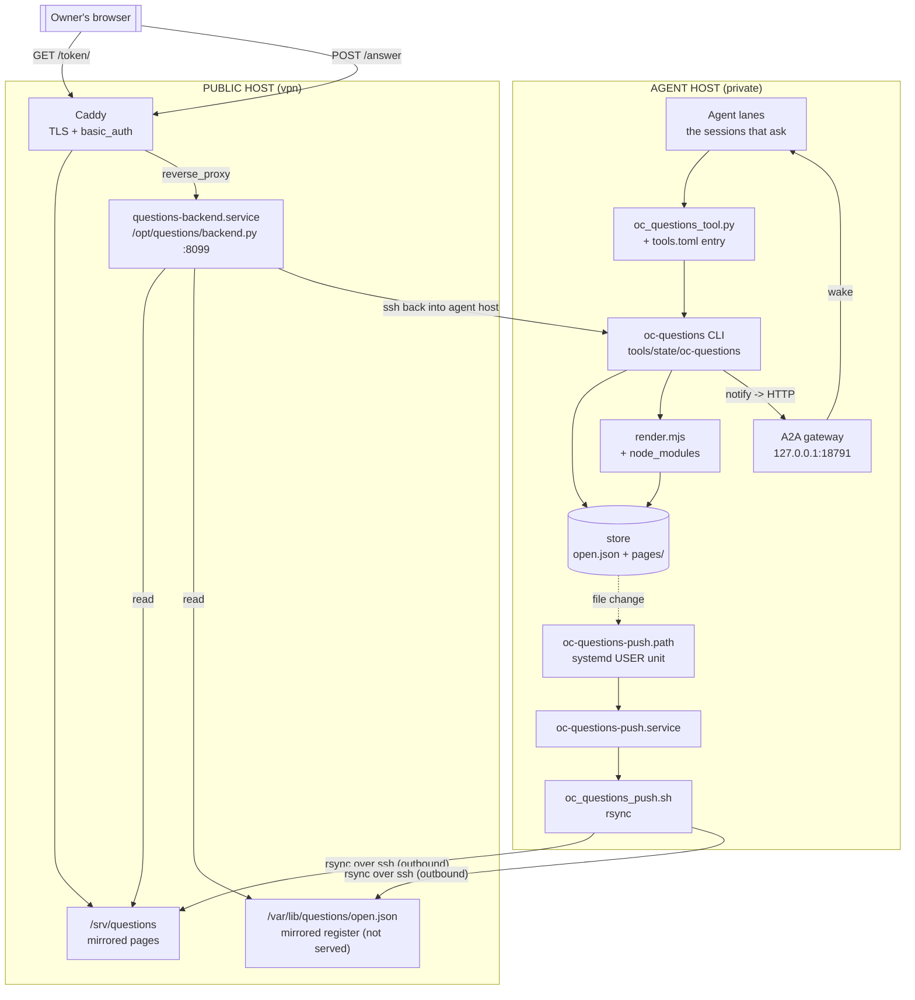
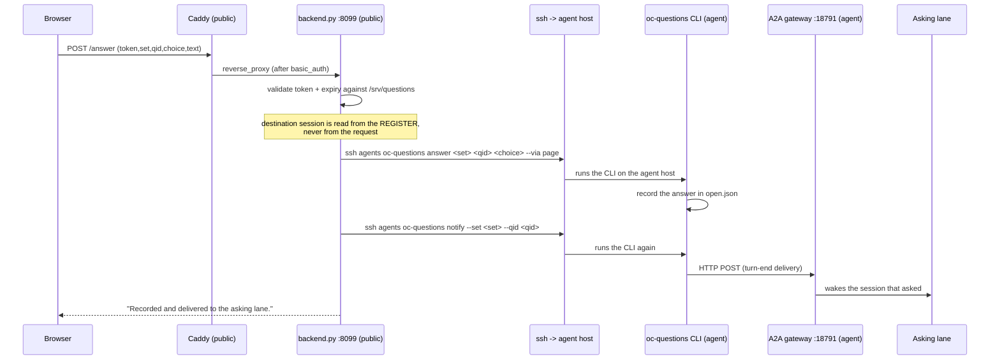

# Open Questions — architecture and the answer return path

**Audience:** whoever is standing up the Open Questions register on their own infrastructure.
**Companion to:** `tools/docs/OPEN-QUESTIONS-INSTALL.md` (the install steps).
**Date:** 2026-10-02.

The install note covers the *asking* side: install the tool, render a page, publish it.
It stops at the point where the page is served. This document covers what the note omits —
**how a page served by a web server gets an answer back into the agent session that asked.**

---

## 1. The short version

The tool never publishes anything itself. It writes a page tree to a local directory and stops.
Everything past that point is **infrastructure you supply**, and it is three legs:

1. **Serve** the page tree from a web server.
2. **Accept** the answer — a small backend process behind that web server, on a path the page
   already posts to (`/answer`).
3. **Return** the answer — the backend must be able to reach the agent host and run the register
   CLI there, which in turn wakes the asking session.

Leg 3 is the one that surprises people. The published page is static, but the *server that serves
it* is not a passive file host: it must hold a working path back into the agent host.

---

## 2. The two hosts

The reference deployment splits the work across two machines, because the agent host is private
and the page is public.

| | **agent host** (private) | **public host** (serves the page) |
|---|---|---|
| what runs there | the agent daemon (the lanes), the register CLI, the store | the web server, the answer backend |
| reaches the internet | outbound only | inbound (public) |
| holds | the register, including the destination session ids | a key that can reach the agent host |
| example | `agents` (private) | `vpn` → `questions.l1979.ru` |

Neither host is privileged over the other in the tool's design — you can run both roles on one
machine (simplest), or split them (what the reference does). The split is only forced by whether
the agent host can be made publicly reachable.

---

## 3. Component map

---

## 4. The answer round trip

If the last hop fails, the answer is **still recorded** — the reader sees
*"Recorded, but the return path did not confirm delivery."* The register is the durable copy; the
wake is best-effort and retried by a separate sweep.

---

## 5. Infrastructure checklist

Everything the tool does *not* give you, in the order you need it.

| # | Need | Where | Notes |
|---|---|---|---|
| 1 | A web server with TLS for a hostname | public host | Caddy in the reference; any server that can serve files and proxy one path |
| 2 | The mirrored page tree at a served root | public host | pushed from the agent host (§6) |
| 3 | The mirrored register, **outside** the web root | public host | it carries session ids; keep it unserved |
| 4 | The answer backend process | public host | `/opt/questions/backend.py`, bound to loopback, proxied at `/answer` |
| 5 | **A path from the public host back into the agent host** | public → agent | an SSH key authorised on the agent host, and the agent host reachable from the public host |
| 6 | The register CLI at a resolvable path | agent host | the backend resolves it at call time; a pinned path breaks silently when the tree moves |
| 7 | The agent daemon's A2A gateway on loopback | agent host | the `notify` verb's target (`127.0.0.1:18791` by default) |
| 8 | A push trigger on the agent host | agent host | a file watcher + a mirror script (§6) |
| 9 | Outbound internet at publish time | agent host | the renderer fetches htmx from unpkg and vendors it beside the page; without it the page falls back to the no-JS form |

**Requirement 5 is the one the install note does not state.** Without it the page renders and the
form posts, and every answer fails at the moment the backend tries to run the CLI.

---

## 6. The push leg

Pages are produced on the **agent host** and mirrored to the **public host**. The direction is
outbound from the agent host, so the public host needs no inbound port *for this leg*:

- A file watcher fires when the store changes (a systemd **user** path unit in the reference,
  watching `open.json` and `pages/latest.json`).
- The watcher runs a mirror script: one canonical render, then `rsync` of the page tree and the
  register to the public host.
- The script compares source and served digests after copying and retries on divergence, so a
  dropped trigger cannot leave the served page one revision stale.

---

## 7. Findings from the reference deployment

Recorded because they cost time and will cost yours.

1. **The "no key back" claim is wrong.** The push script's own header says the public host holds
   no key that can reach the private one. That is true of the *mirror* leg and false of the
   *answer* leg: the backend requires exactly such a key and uses it on every answer. Do not
   design the split on the assumption that the public host is harmless if compromised — it holds
   a root path into the agent host.

2. **A pinned CLI path is a silent landmine.** An earlier backend revision hardcoded the CLI at
   `tools/oc-questions`. When the CLI moved to `tools/state/oc-questions`, every answer started
   failing with `rc=127` and surfaced only as a 502 to the reader. The deployed backend now
   resolves the path at call time (search the tools tree, require **exactly one** match, exit 127
   otherwise). Resolve, do not pin.

3. **The mirror of the backend was stale.** The deployed `/opt/questions/backend.py` and the
   in-repo copy had drifted to different revisions. If you keep a copy in your repo, sync it from
   the deployed one, not the other way round.

---

## 8. Running it on one host

If your agent host can be reached by the public web server (or *is* the public web server), the
split collapses:

- run the backend on the same host as the agent daemon;
- point the backend's CLI at the local path (no ssh);
- skip the push leg entirely — the web server can serve the store's `pages/` directory directly.

The only thing you lose is the isolation between "the machine that holds your sessions" and "the
machine the internet can reach". Everything else is identical.
